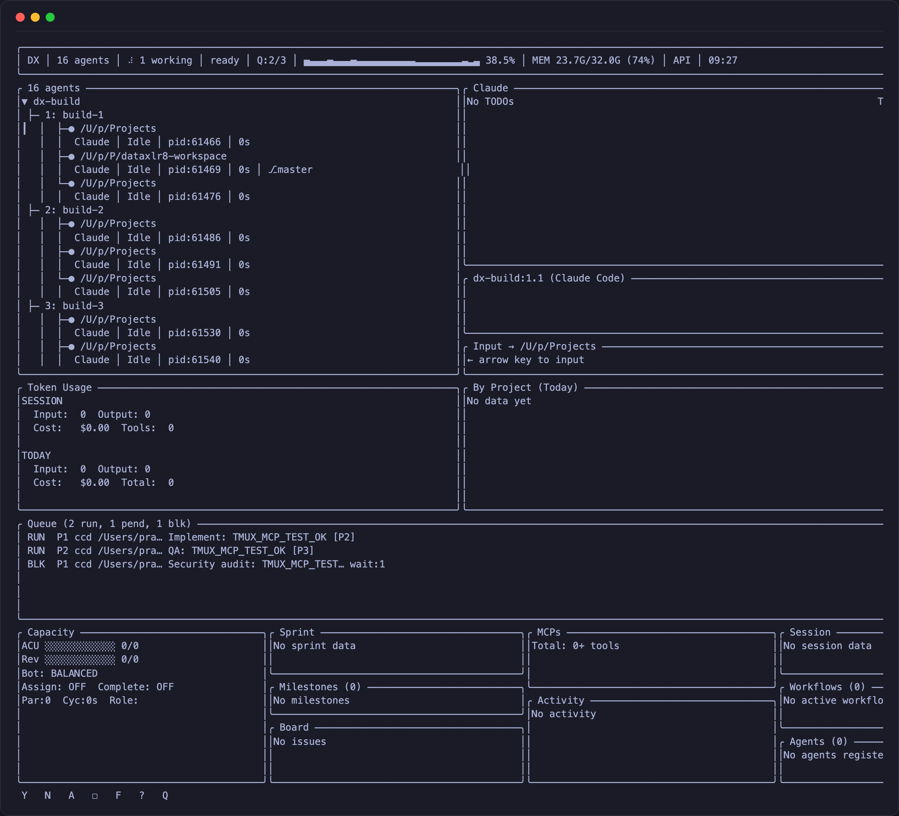

<div align="center">

# DX Terminal

**The AI-native terminal multiplexer. Monitor 16+ coding agents from one screen.**

[](https://github.com/pdaxt/dx-terminal/actions/workflows/ci.yml)
[](LICENSE)
[](https://github.com/pdaxt/dx-terminal)

Open source. No login. No telemetry.



[Quick Start](#install) · [Features](#what-it-does) · [Comparison](#comparison) · [Architecture](#architecture) · [Contributing](#contributing)

</div>

---

## The Problem

You're running 16 Claude Code agents across tmux panes. One needs approval. Another is stuck. A third is burning tokens on the wrong file. You're alt-tabbing between panes like a madman, losing context every time.

## The Solution

DX Terminal gives you **one screen to rule them all** — a real-time TUI dashboard that monitors every AI agent across your terminal sessions. See who's working, who's blocked, what they're doing, and how much they're costing you. Built in Rust, renders at 60fps, uses <5MB RAM.

## Install

**Homebrew (macOS & Linux):**
```bash
brew install pdaxt/tap/dx-terminal
```

**Cargo:**
```bash
cargo install dx-terminal
```

**Shell script:**
```bash
curl -fsSL https://raw.githubusercontent.com/pdaxt/dx-terminal/main/install.sh | bash
```

**From source:**
```bash
git clone https://github.com/pdaxt/dx-terminal.git
cd dx-terminal
cargo install --path .
```

## Usage

```bash
dx                    # Launch (native PTY mode)
dx --tmux             # Legacy tmux monitoring mode
dx --debug            # Write debug logs
dx --init-config      # Generate config file
```

## What It Does

DX Terminal detects and monitors AI coding agents running in your terminal:

| Agent | Detected |
|-------|----------|
| Claude Code | Yes |
| OpenCode | Yes |
| Codex CLI | Yes |
| Gemini CLI | Yes |

For each agent it shows:

| Feature | What You See |
|---------|-------------|
| **Agent Tree** | Hierarchical view across sessions/windows/panes |
| **Live Status** | Idle, Working, Awaiting Approval, Error — real-time |
| **Dashboard** | Capacity, sprint, milestones, board, MCPs, session metrics |
| **Task Queue** | Running, pending, and blocked tasks with priorities |
| **Token Tracking** | Per-session and daily input/output tokens + cost |
| **Analytics** | CPU sparkline, memory usage, API status at a glance |
| **Pane Preview** | Live output from any agent without switching |
| **Git Status** | Branch, uncommitted changes per project |
| **Subagents** | Tracks spawned sub-tasks with their lifecycle |
| **Context** | Remaining context window percentage |

## Key Bindings

| Key | Action |
|-----|--------|
| `j`/`k` or arrows | Navigate agents |
| `y` | Approve pending request |
| `n` | Reject pending request |
| `a` | Approve ALL pending |
| `1`-`9` | Answer numbered choices |
| `Space` | Toggle selection |
| `f` | Focus (jump to agent's pane) |
| `i` | Input mode (type to agent) |
| `D` | Toggle dashboard |
| `X` | Toggle analytics |
| `Q` | Toggle task queue |
| `P` | Toggle factory view |
| `?` | Help |
| `q` | Quit |

## Comparison

| Feature | DX Terminal | claude-squad | tmux (raw) |
|---------|:-----------:|:------------:|:----------:|
| Language | Rust | Go | C |
| Agent monitoring | 16+ simultaneous | Single-focus | Manual |
| Dashboard views | 5 built-in panels | 1 | 0 |
| Token/cost tracking | Built-in | No | No |
| Task queue | Visual with priorities | No | No |
| Memory usage | <5MB | ~20MB | ~3MB |
| Agent types | 4 (Claude, OpenCode, Codex, Gemini) | Claude only | N/A |
| Git integration | Per-project status | No | No |
| MCP server | Built-in | No | No |
| Native PTY | Yes | No | Yes |

## Architecture

Built entirely in Rust. Native PTY management — no tmux dependency required.

```
┌─────────────────────────────────────────────────────┐
│                    DX Terminal                        │
│                                                       │
│  ┌───────────┐  ┌───────────┐  ┌─────────────────┐  │
│  │ Agent     │  │ Dashboard │  │ Queue           │  │
│  │ Tree      │  │ Panels    │  │ Manager         │  │
│  └─────┬─────┘  └─────┬─────┘  └────────┬────────┘  │
│        │               │                 │            │
│  ┌─────┴───────────────┴─────────────────┴─────────┐ │
│  │            Ratatui TUI (60fps)                   │ │
│  └──────────────────────┬──────────────────────────┘ │
│                         │                             │
│  ┌──────────────────────┴──────────────────────────┐ │
│  │  PTY Manager (portable-pty) + VTE Parser        │ │
│  │  Agent Detection (process tree + pattern match) │ │
│  │  Analytics (SQLite token/cost tracking)         │ │
│  │  MCP Server (built-in, controllable by agents)  │ │
│  └─────────────────────────────────────────────────┘ │
└─────────────────────────────────────────────────────┘
```

## Configuration

```bash
dx --init-config      # Creates default config
dx --show-config-path # Shows path
```

Config file (TOML):
```toml
poll_interval_ms = 500
capture_lines = 100

[[agent_patterns]]
pattern = "my-custom-agent"
agent_type = "CustomAgent"
```

| OS | Config Path |
|----|-------------|
| macOS | `~/Library/Application Support/dx-terminal/config.toml` |
| Linux | `~/.config/dx-terminal/config.toml` |

## Contributing

```bash
git clone https://github.com/pdaxt/dx-terminal.git
cd dx-terminal
cargo test
cargo clippy -- -D warnings
cargo fmt
```

PRs welcome. Run the checks above before submitting.

## License

MIT — see [LICENSE](LICENSE) for details.

---

<div align="center">

**Built for developers who run AI agents at scale.**

</div>
