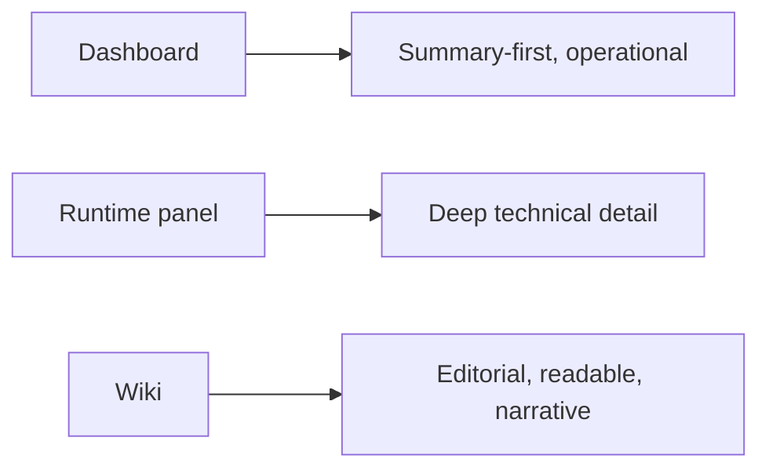

# Interface And Visual System

## Purpose

DX Terminal needs a visual system that helps non-technical people read the product confidently while still supporting dense technical work.

This document defines that visual direction.

## Surface Strategy

The product should not force every surface to feel the same.

- the dashboard should be calm, direct, and staged from summary to detail
- the runtime panel should stay dense and operational
- the wiki should feel like a handbook, not a terminal dump

## Hierarchy Rules

The interface should be read in this order:

1. mission and active focus
2. stage and blockers
3. documentation and sync health
4. active work lanes
5. raw terminal detail

If raw activity is visually louder than mission, stage, or blockers, the hierarchy is wrong.

## Color Semantics

Color should carry consistent meaning across the product:

- blue: active flow, overview, movement
- amber: discovery and unresolved work
- teal: testing, verification, and operational inspection
- green: complete, verified, healthy
- red: blocked, failed, unsafe to trust
- slate: inactive or informational context

## Logo And Identity Direction

The mark should feel like a control plane, not a crypto dashboard or gaming UI.

The current direction is:

- compact `DX` monogram
- rounded geometry
- blue-to-teal motion-oriented accent
- restrained contrast around the mark so the rest of the interface stays readable

## Typography Direction

Use typography to separate intent from raw machine output:

- large, confident sans-serif headings for overview and action
- monospace only for code, ports, branches, and terminal data
- readable paragraph sizes for all handbook content

## What “Good” Looks Like

A strong DX Terminal interface should let a new stakeholder say:

- I understand what is happening
- I know what stage the work is in
- I know whether the docs match reality
- I know where to go if I need deeper evidence

If the interface instead says “you need terminal fluency to use this,” it has failed the brief.
